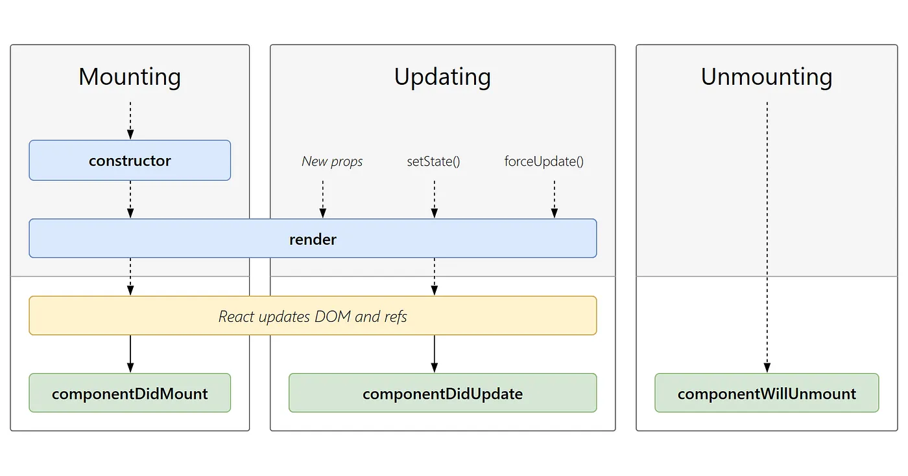

# Bundling

- chunking
- dynamic bundling
- code spliting
- on demand Loading
- Dynamic Import

@ These will help to distribute our app in small chunks which has specific page to do some task

# - lazy loading
- import syntax

      const Grocery = lazy(() => import("./components/Grocery"));

        <Route
            path="/grocery"
            element={
            <Suspense fallback={<h1>Loading...</h1>}>
                {" "}
                <Grocery />{" "}
            </Suspense>
            }
        ></Route>

- this will create a sperate bunding file to perform specific task

- if we donot use this, our whole file in a single bundle and perfrom slow at large project.

# How to create and use Redux Store

- Step 1st : Create AppStore where all stores are stored

        import {configureStore} from '@reduxjs/toolkit'
        import cartReducer from './cartSlice'

        const appStore = configureStore({
            reducer: {
                cart: cartReducer,
            }
        });

        export default appStore

- Step 2nd : Create Cart Slice and reducers

        
        import {createSlice} from '@reduxjs/toolkit'

        const cartSlice = createSlice({
            name: 'cart',
            initialState: {
                items : []
            },

            reducers: {
                addItem: (state, action) => {

                    // Vanilla(Older) Redux => Don't Mutate State and returning was mendatory
                    // const newState = [...state]
                    // newState.items.push(action.payload);
                    // return newState

                    // we have to mutating the state here
                    state.items.push(action.payload);
                },
                removeItem: (state) => {
                    state.items.pop();
                },
                clearCart: (state) => {
                    state.items = [];
                } 
            }
        })
        

        export const {addItem, removeItem, clearCart} = cartSlice.actions;
        export default cartSlice.reducer;

- Step 4th : Rape the App with Redux Provider

        <Provider store={appStore}>
        <>
          <Header />
          <Outlet />
        </>
        </Provider>

- Step 5th : To access the store value we have to subscribe the store
- For that, use useSelector hook of redux

        const cartItems = useSelector((store) => store.cart.items);

        <li className="p-2 m-2">
            <Link to="/cart"> Cart - ({cartItems.length}) </Link>
          </li>

- Step 6th : To update the store value, use useDispatch hook of redux

          const dispatch = useDispatch();

          const handleClearCart = () => {
              dispatch(clearCart());
          };

        <button
          className="p-2 m-2 bg-black text-white rounded-lg"
          onClick={handleClearCart}
        >
          Clear Cart
        </button>

# Notes
- Redux Use Immur Behind The Screen
- RTK says mutate the existing state or return a empty state

    - state.items.length = 0       
    - return {items : []};

- not mutating the state and creating copy of state into empty form
    - state.items = [];    
- will replace original state empty
    - return {items : []};      

# Class Base Components

- Class Base Components Structure

        import React from "react";
        class UserClass extends React.Component {
        constructor(props) {
            super(props);
            console.log(props);

            this.state = {
            count: 100,
            FullName : "Aman Kumar Jha"
            };
        }

        render() {
            const { location, name } = this.props;

            const { FullName, count } = this.state;

            return (
            

                <h1>Count :{this.state.count}</h1>
                <h2>Name : {FullName}</h2>
                <h2>FullName : {this.props.FullName}</h2>
                <h2>Class : BCA</h2>
                <h3>Roll : 12</h3>
                <h4>Location : {location}</h4>
            

            );
        }
        }

- State In Class Base Components

  - State decleared under the constructor

          - constructor(props) {
          super(props);
          console.log(props);

          this.state = {
          count: 100,
          FullName : "Aman Kumar Jha"
          };

    }

  - How We Set the Value of State Variables..

        

        <h1>Count :{this.state.count}</h1>
        <button
          className="border-2 border-blue-700 bg-pink-400 text-gray-700"
          onClick={() => {
            this.setState({
              count: this.state.count + 1,
              FullName: this.state.FullName + " Purushottampur",
            });
          }}
        >
          Increase Count
        </button>

      

# Life Cycle of Class Base Components

- when the parent components see the classbase components when it render the constructor first, then the render method of class base components

- componentdidmount will work after render process 

- work flow

       - 1st parent constructor, 2nd  parent render method, 3rd child constructor, 4th child render method, 5th child componentdidmount, 6th parent componentdidmount

      - parent Constructor

            - parent Render

            - child1 constructor
            - Child1 render
            
            - child2 constructor
            - child2 render

          # Dom Updated in single batch
          - child1 componentsdidmount
          - child2 componentsdidmount

          - child1 componentdidUpdate
          - child2 componentdidUpdate
          
          // it called when disabling from the page
          - child1 componentWillMount
          - child2 componentWillMount

      - parent componentsdidmount
      - parent componentsdidUpdate

# What Componnent Did Mount Work:-
- ComponentsDidMount will use to do api call and fill the render Elements because
react work flow is as that it firstly render the element and then do api calls, so components did mount use to fill the render eleemnts..

# Api Fetching in Class Base Components
- fetch is done under the method componentDidMount

      async componentDidMount() {

      const data = await fetch("https://api.github.com/users/jhAman-9");

      const json = await data.json();

      console.log(json);

      this.setState({
        userInfo: json,
      });

      console.log(json);
    }

# Note
- react render the components then do api calls

- Mountin means showing to the UI
- UnMounting Means disabling from the UI

- react first update the dom with the dummy or initilized data and then the api call after that the state variable get updated and render method call once again

- UseEffect is not equavalent to componentsDidMount()

    # UseEffect
    - if there is no dependency array, it is will call at every render

    - if there is empty dependency array it is called only one time at initailly

    - dependency is array because of lots of dependency condition

    useEffect(() => {
      // API Call
    },[])
    
    # Where As ComponentDidMount Work was
    - ComponentDidUpdate will call at every updation
    
    - In it, updation is perform after to check the prevState, prevProps

      -  componentDidUpdate(prevState,prevProps){
          if(
            this.state.count !== prevState.count
          )
          {
            // code
          }
        }

- Mounting
    -   constructor
    -   Render (dummy)
    -   HTML with Dummy data
    -   ComponentDidMount
    -   Api Call
    -   <this.setState>  state variable is updated

- Update
    - render(Api Data)
    - HTML (loaded with new Setdata) 
    - component Did Update

# SetInterval Effect in ComponentDidMount and UseEffect

- if we start setInterval into to the ComponentDidMount, then it will not stop while we are not stop it into the ComponentWillMount, After then go into the another page eles it will run no. of page move you start

      componentDidMount() {
        setInterval(() => {
          console.log("SetInterval In ComponentDidMount");
        })
      }

      // Clear Interval
       componentWillUnmount() {
          console.log("component Will Mount");
          clearInterval();
        }

- use this keyword, so that after going to the next page new setInterVal will not start and stop there..

        // using with This to not reflect SetInterval Into Next page
          componentDidMount() {
            this.timer = setInterval(() => {
              console.log("SetInterval In ComponentDidMount");
            }, 1000);
        }

        componentWillUnmount() {
          clearInterval(this.timer);
          console.log("component Will Mount");
        }

- Where as if we start setInterval Into useEffect  and we got to the next page , it will no stop until we didnot stop it..

      useEffect(() =>{
        const timer = setInterval(() =>{
          console.log("SetInterval Start");
         },1000);
        
        console.log("useEffect")

         return () =>{
          clearInterval(timer);
          console.log("useEffect return")
         }

      },[])

# Context_API

- Conetext Solve the Problem of Props Drilling
- And Always Try to create Context outside of components folder..Like in Utils and other

- How We create Context:

        import { createContext } from 'react';

        const UserContext = createContext({
            loggedInUser : "Aman",
        })

        export default UserContext

# How We use Context:

        import { useContext } from "react";
        import UserContext from "../utils/UserContext";
        function Header() {

            // Extracting Data
            // passing the userContext to decleare that I want data from this UserContext

            const { loggedInUser } = useContext(UserContext);

            return (
                <li className="p-2 m-2">Log In : { loggedInUser}</li>
            );
        }

        export default Header;

# How to change Context Values

    - Need to rape the part to which I want to change the Value

            function App() {
                const [userName, setUserName] = useState("Aman Kumar Jha");
                return (
                    <UserContext.Provider value={{ loggedInUser: userName }}>
                    <>
                        <Header />
                        <Outlet />
                    </>
                    </UserContext.Provider>
                );
            }

# How to change context value through input box

- firstly I have provide the function setUserName throught Context Provider to the components of input field..

1st Step:

      const [userName, setUserName] = useState("Aman Kumar Jha");
        return (
            <UserContext.Provider value={{ loggedInUser: userName, setUserName }}>
            <>
                <Header />
                <Outlet />
            </>
            </UserContext.Provider>
        );

2nd Step:

- Extract the value and function through useContext

      const { loggedInUser, setUserName } = useContext(UserContext);

          <label>Change User Name : </label>
          <input value={loggedInUser} onChange={(e) => setUserName(e.target.value)} />

# Provide Different Value At Different Layer of UseContext.Provider

        function App() {
                return (

                    <UserContext.Provider value={{ loggedInUser: "Aman Kumar" }}>
                    <>

                        // Header has "Aman"

                        <UserContext.Provider value={{ loggedInUser: "Aman" }}>
                        <Header />
                        </UserContext.Provider>

                        // Outlet has "Aman Kumar"

                        <Outlet />
                    </>
                    </UserContext.Provider>
                );
            }

# Custom Hook
- Custom Hooks made code easily testable  

        const useRestaurantMenu = (resId) => {
            const [resInfo,  setResInfo] = useState([])

            useEffect(() => {
                fetchData();
            }, []);
            
            const fetchData = async () => {
                const Data = await fetch(
                SWIGGY_RESTAURANT_DETAIL_API_END_POINT + resId
                );
                const json = await Data.json();
                setResInfo(json.data);
            }

            return resInfo;
        }

        export default useRestaurantMenu;

# Higher Order Components

- it will return some piece of jsx

        // Higher Order Components
        // input  -  RestaurantsCard ==> RestaurantsCardPromoted 
        export const withPromotedLabel = (RestaurantCard) => {
        return (props) => {
            return (
            

                <label className="absolute bg-black text-white m-2 p-1 rounded-lg">open</label>
                <RestaurantCard {...props} />
            

            )
        }
        }

# Important Concept
- https://react.dev/learn/sharing-state-between-components

# Controlled Component
- it is controlled by the Parent to child components

# Higher Order Components

# Export Types

- Default Export/ Import
export default Componet;
import Component from ....

- Named Export/Import
export const Component;
import {component} from ....

# Hooks
 (Normal JS Utiliy Functions)
 - UseState -> Superpowerful State Variabe

- UseEffect
    - if no dependency array in useEffect, it is called on every render.

    - if dependency array in empty, it will call initial render (only one)

    - if dependency array, then change in dependency it will call..

# Route 
- Client Side Routing
- i} create createBrowerRouter
- ii) RouterProvoder to provide the routing paths
- iii) for children routing the another children routing is mention with router keyword and in a nested mannner..

        const appRouter = createBrowserRouter([
        {
            path: "/",
            Element: <App />,
            errorElement: <Error />,
            children: [
            {
                path: "/about",
                element: <About />,
            },
            {
                path: "/contact",
                element: <Contact />,
            },
            ],
        },
        ]);

# Outlet
- we never change into the part outlet will be fill in that path
- outlet will be replaced by the path components

# Anchor Tag
- <a href="">  --> ❌❌
- Never use Anchor tag in React page because it will re-render the  whole page 
- Instead of Anchor tag use Link tag because it just refresh the  components

          <li className="p-2 m-2">
            <a href="/home">Home</a>            // Don't use this way
          </li>

          <li className="p-2 m-2">
            <Link to="/about">About us</Link>
          </li>

          <li className="p-2 m-2">
            <Link to="/contact">Contact us</Link>
          </li>

- Linking every restorent with specific Id
.png>)

# Online Status Custom Hook
- This will show you that you are online or offline

        import { useEffect, useState } from "react";
        const useOnlineStatus = () => {
            const [onlineStatus, setOnlineStatus] = useState(true);

            useEffect(() => {
                window.addEventListener("online", () => {
                    setOnlineStatus(true)
                });

                window.addEventListener("offline", () => {
                    setOnlineStatus(false);
                })

            },[])
            return onlineStatus;
        }

        export default useOnlineStatus

        # Types of Testing (developer)
- Unit testing  --> test react app in issolation
- Integration testing  
- End to end testing (e2e - testing)

# Setting up library in our react app
- Install react testing library     (https://     testing-library.com/docs/react-testing-library/intro/)

- Installed Jest

- Install Babel Dependencies

- Configure Babel  
 (https://jestjs.io/docs/getting-started)

- configure Parcel config file to disable default  babel transpilation  
 (https://parceljs.org/languages/javascript/#babel)

- configure jest 
(npx jest --init)

- install jsDom library
(npm i --save-dev jest-environment-jsdom)

- npm i -D preset-react
after that add preset to babel.config.js file too

        module.exports = {
        presets: [
            ["@babel/preset-env", { targets: { node: "current" } }],
            ["@babel/preset-react", { runtime: "automatic" }],
        ],
        };

# Test file
- create test file